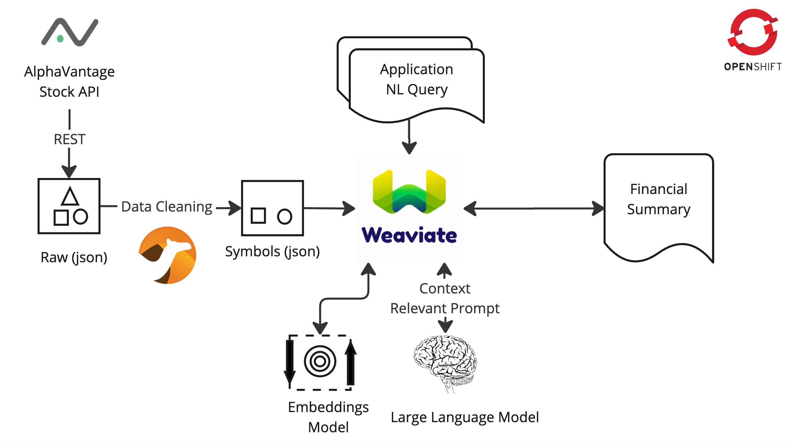
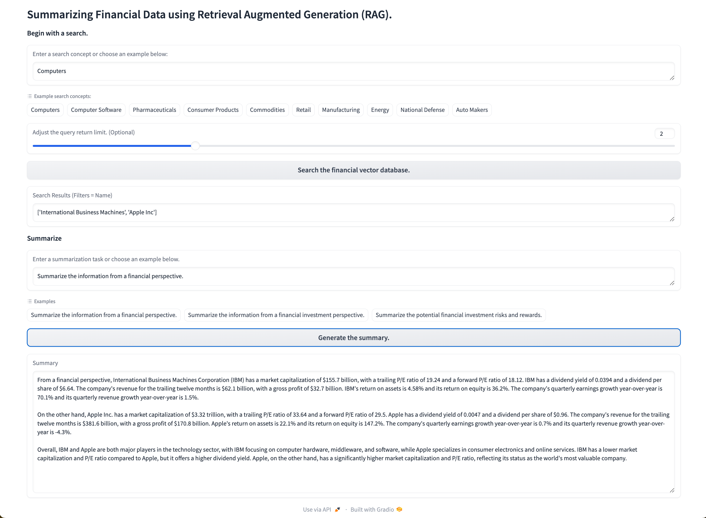

# Summarizing Financial Data with a RAG workflow using [Weaviate](https://weaviate.io/), [Red Hat OpenShift](https://developers.redhat.com/developer-sandbox) and [Red Hat Build of Apache Camel](https://developers.redhat.com/products/redhat-build-of-apache-camel/overview).


*High Level Components*

### Overview
This demonstration imports and syncronizes financial data from [AlphaVantage](https://www.alphavantage.co)
into [Weaviate's vector database](https://weaviate.io) which in turn uses a large language model to generate a summary 
in a traditional RAG workflow.

The Weaviate database is installed on Openshift as a stateful set providing
a data parallel enterprise deployment. For the application developer, Openshift DevSpaces offers a full IDE experience
within a Kubernetes environment. Finally, a simple example application based on Hugging Face's Gradio framework provides a user front-end.


*Dataflow*

To build the vector database, a number of company overviews are downloaded using 
[AlphaVantage's Stock Market API](https://www.alphavantage.co/query?function=OVERVIEW&symbol=IBM&apikey=demo)
and imported into Weaviate. This represents a private knowledgebase. Each overview 
consists of a short description along with sampling of financial metrics such as market
capitalization, book value and earnings per share just to name a few. A user can then query 
the database using a natural language and Weaviate will return companies that are most 
similar to the concept. Finally, a generative search is performed using the
[granite3-dense:8b](https://ollama.com/library/granite3-dense:8b) large language model (LLM) to generate a 
financial summary which is presented to the user. It is important to note that the summary is 
based on the financial data from the original company overview database and not the LLM.  


*Application Screen Shot*

### Why run Weaviate On Openshift?
- Support for [Distributed Architectures](https://weaviate.io/developers/weaviate/concepts/replication-architecture).
- A Great Developer Experience (Easily move code -> containers)
- Access your cluster via the Weaviate Cloud Console with external routes.
- Security (Doesn't run your containers as root)

### Prereqs:
- `cluster-admin` access to [Red Hat Openshift](https://developers.redhat.com/developer-sandbox)
- An [AlphaVantage API key](https://www.alphavantage.co/support/#api-key) 
  - This is optional if you want to refresh the stock symbol data.

### Manual Installation Steps

#### Install the following services on Openshift.
1. Weaviate Vector Database
2. Ollama Model Server
3. Stock Overview Ingestion Engine
4. Gradio UI and application.

##### Install Weaviate
- [Install a Weaviate instance](install-weaviate.md) in the `weaviate` namespace.

##### Install Ollama
- Install an [Ollama model server](https://github.com/bkoz/ollama) in the `ollama` namespace.
  - The `all-minilm` and `granite3-dense:8b` models should be [pulled](https://github.com/ollama/ollama/blob/main/docs/api.md#pull-a-model) after install. This can be done using `curl` or the `ollama` cli tool from an Openshift or DevSpaces terminal.

```bash
curl http://ollama.ollama/api/pull -d '{"model": "granite3-dense:8b"}'
curl http://ollama.ollama/api/pull -d '{"model": "all-minilm"}'
```

```bash
curl http://ollama.ollama/api/embed -d '{ "model": "all-minilm", "input": "Why is the sky blue?" }'
```

```bash
curl http://ollama.ollama/api/generate -d '{ "model": "granite3-dense:8b", "prompt": "Why is the sky blue?", "stream": false }'
```

##### Stock Overview Ingestion Engine

The stock overview ingestion engine consists of two components.
- A Caching Proxy
  - Follow the instructions to install the [caching proxy](https://github.com/joshdreagan/av-caching-proxy.git) in 
the `camel` namespace.

- A Stock Overview Syncronizer
  - Follow the instructions to install the [AlphaVantage syncronizer](https://github.com/joshdreagan/av-overview-sync.git) in 
the `camel` namespace. Configure the `av-overview-sync-configmap` configmap to use the `granite3-dense:8b` model. 

##### Deploy the application. 
1. From a terminal, create an Openshift application.
```bash
oc new-app python~https://github.com/redhat-na-ssa/demo-ai-weaviate --context-dir=/src --name=rag \
--env WEAVIATE_API_KEY=your_weaviate_admin-api-key
```
2. Expose the app with an external route and have fun.
```bash
oc create route edge --service rag --insecure-policy='Redirect'
```

#### Automated Installation (work in progress)

### Clean up
```bash
oc delete all --selector=app=rag
helm uninstall weaviate
```

#### Remove the Openshift storage.
```bash
oc delete pvc weaviate-data-weaviate-0 weaviate-data-weaviate-1
```

### Additional ways to get access to Openshift.
- Create a mini-cluster by [installing Code Ready Containers](https://www.okd.io/crc/)
- Install an [OKD cluster](https://www.okd.io/installation/) and Eclipse-Che.
- Install an [Openshift](https://www.redhat.com/en/technologies/cloud-computing/openshift) cluster and DevSpaces.
- As a managed service from any of the major cloud providers.

