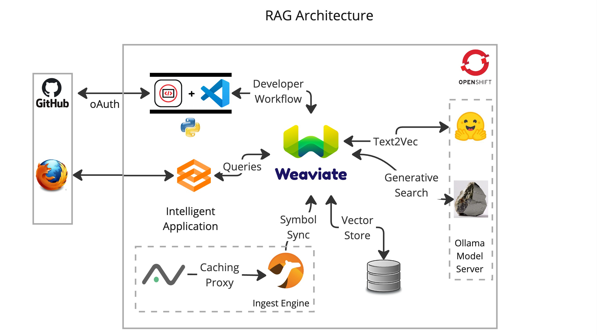

# JumpStart your [Vector Database](https://weaviate.io/) to enterprise scale with [Openshift](httos://okd.io)

## Agenda

### What we will build.


### What's needed:
- Access to a free [Openshift Developer Sandbox](https://developers.redhat.com/developer-sandbox).
- A [HuggingFace API key](https://huggingface.co/settings/tokens).
- An [OpenAI API key](https://platform.openai.com/account/api-keys).

### Why run Weaviate On Openshift
- Support for [Distributed Architectures](https://weaviate.io/developers/weaviate/concepts/replication-architecture).
- A Great Developer Experience (Easily move code -> containers)
- Access your cluster via the Weaviate Cloud Console with external routes.
- Security (Doesn't run your containers as root)

### Get Started
- [Open this repo in the Developer Sandbox](https://workspaces.openshift.com/f?url=https://github.com/bkoz/weaviate)

### Developer Tools: Eclipse-Che/DevSpaces
- A full IDE experience with a code debugger.
- Leverage many VSCode extensions.
- In cluster terminal with CLI access to the Openshift API.
- Deploy and test your app with port forwarding.
- GitHub integration improves workflow efficiency.
- Environment variables are read in as secrets.
- DevSpaces is a no-cost add-on to Openshift

#### Setup for development: 
1. **View -> Command Palette** -> Enter: `dev spaces: open openshift console`.
2. Use the Openshift Web UI to **create a secret with environment variables**.
   * **Secrets -> Create** and **Save** a new secret (from yaml) using this [example](resources/che-env.yaml).
   * **Edit ->** Change the values in the secret to match your environment. Your instructor will provide the values.
3. **Extensions** -> Install the reccomended Python extension.
4. **View -> Command Pallette** Enter: `run task` -> devfile -> Create the python virtual environment
5. **Terminal -> New Terminal**
6. Use the helm client to **install Weaviate** and wait for the 2 weaviate pods to become ready.
```bash
PROJ=$(oc project -q)
```
```bash
helm repo add weaviate https://weaviate.github.io/weaviate-helm
```
```bash
helm upgrade --install weaviate weaviate/weaviate --namespace ${PROJ} --values ./values.yaml
```
```bash
oc get pods -w
```
```bash
curl weaviate.${PROJ} | jq
```
7. Run a few python test clients from the `src` directory.
```bash
python src/00-test-connection.py
```
```bash
python src/03-gradio.py
```

### Move the app into production.
1. From the terminal, create an Openshift application.
```bash
oc new-app python~https://github.com/bkoz/weaviate --context-dir=/src --name=rag
```

2. Create a secret for the application environment variables from the example.
```bash
oc apply -f resources/app-env.yaml
```
  * Use the web console UI or CLI to edit the values in the secret to reflect your environment.

3. Add the secret to the rag deployment.
```bash
oc set env --from=secret/app-env deployment/rag
```

4. Expose the app with a route.
```bash
oc create route edge --service rag --insecure-policy='Redirect'
```

### Clean up
```bash
oc delete all --selector=app=rag
helm uninstall weaviate
```

### Additional ways to get access to Openshift.
- Create a mini-cluster by [installing Code Ready Containers](https://www.okd.io/crc/)
- Install an [OKD cluster](https://www.okd.io/installation/) and Eclipse-Che.
- Install an [Openshift](https://www.redhat.com/en/technologies/cloud-computing/openshift) cluster and DevSpaces.
- As a managed service from any of the major cloud providers.

#### Versions
v0.1.0
